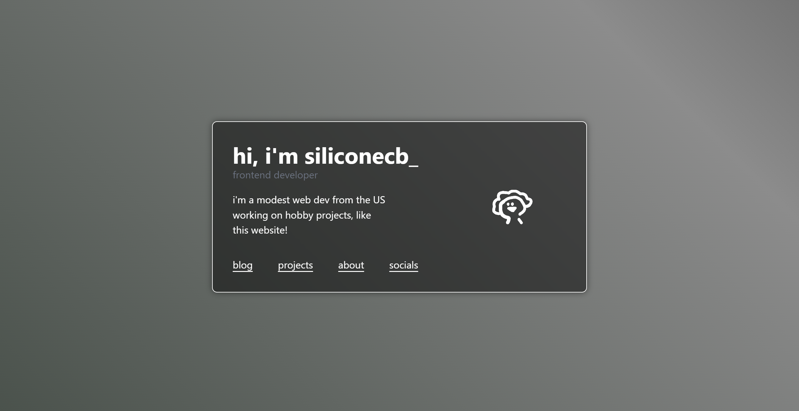

# siliconecb.cc
previously beta.siliconecb.cc, the site is just about finished so it's in production now! 🎉

## install

1. clone the repo:
   ```bash
   git clone https://github.com/silicone-fig/siliconecb.cc.git
   cd siliconecb.cc
   ```
2. install dependencies:
   ```bash
   npm install
   ```

   if that fails, try:
   ```bash
   npm install --legacy-peer-deps
   ```

3. run the dev server:
   ```bash
   npm run dev
   ```

## running in production

1. edit .env file (optional)
   
    set whatever IP/Port you want to bind to
3. run the prod server
   ```bash
   node server.js
   ``` 

## bugs / contributing
- open an issue if you find bugs please :)
- you can contribute by opening a pull request

## Contributors

<!-- ALL-CONTRIBUTORS-LIST:START - Do not remove or modify this section -->
<!-- prettier-ignore-start -->
<!-- markdownlint-disable -->

<!-- markdownlint-restore -->
<!-- prettier-ignore-end -->

<!-- ALL-CONTRIBUTORS-LIST:END -->
